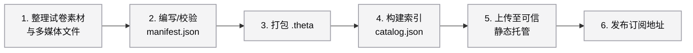

# Theta Format (`.theta`)

通用、开放的题库内容数据格式和传输规范

[English](./docs/README_en.md)

---

- **GitHub Repository**: [https://github.com/thetaformat/protocol.git](https://github.com/thetaformat/protocol.git)
- **Specification Version**: `1.0.0`

---

## 1. 简介与设计理念

`.theta` 是一种专为 AI 时代设计的结构化、原生开放题库数据格式和传输规范。传统的教育测量数据（如 QTI、Common Cartridge）存在体积臃肿、对现代 AI 算力不友好、难以在客户端实现轻量化交互等局限性。

Theta Format 的核心设计理念如下：

1. **AI 友好（AI-Native）**：数据高度结构化，提供描述性的 Zod Schema，便于大模型进行内容生成、校对、结构化提取与多维度的数据分析。
2. **开放标准与数据主权（Open & Vendor-Neutral）**：协议完全开源。我们希望打破商业 LMS（Learning Management System）平台的数据孤岛，解析引擎与数据存储完全解耦。教育者、机构和学校对自己的数据拥有绝对的控制权，不再被特定的服务器或商业数据库强制绑定。
3. **强类型保证（SSOT）**：通过 Zod 与 TypeScript 强类型系统保障“单一真理源”（Single Source of Truth），防止试卷内容与工程代码在高速迭代中出现不对齐。

---

## 2. `.theta` 文件物理结构

`.theta` 文件本质上是一个标准的 ZIP 压缩包（后缀修改为 `.theta`），其内部物理布局如下：

```text
my-exam-paper.theta
├── manifest.json         # 包含试卷大纲、题目树结构、富文本题干及作答/判分 Schema 定义
└── media/                # 存放该试卷关联的静态媒体文件夹
    ├── 3a1f4b8c-d2e9-4f0a-b1c2-d3e4f5a6b7c8.mp3  # 使用 UUID 命名的音频
    └── c4d3e2b1-a0f9-4e8d-8c7b-6a5b4c3d2e1f.png  # 使用 UUID 命名的图片
```

- **`manifest.json`**：符合 `ManifestSchema` 约束，定义了试卷（Paper）、小节（Section）、任务（Task）以及题目（Item）的嵌套关系。
- **静态资源规范化**：`media/` 目录中的多媒体资产使用 UUID，统一资源寻址标准，方便全局防重。

---

## 3. 订阅源社区贡献指南（Subscription Source Contribution Guide）

**本项目不仅服务于 LMS 系统研发人员，更是面向广大“内容创作者（Content Contributors）”的开放工具。**

在教育数字化时代，优秀的教研员、教师和第三方创作者是整个生态的核心。我们通过引入标准化的订阅源机制，帮助创作者更便捷地分发优质内容并获得应有的连接。我们鼓励社区共同建设一个开放、繁荣且尊重知识价值的题库生态。

### 3.1 什么是题库订阅源？

订阅源由一个公开/受保护的 URL 组成，它指向一个符合 `CatalogSchema` 的结构化索引文件 `catalog.json`。该索引文件声明了提供者信息、最新更新时间、以及各套试卷包（`.theta`）的下载地址（`downloadUrl`）。

### 3.2 制作与贡献工作流（Workflow）



#### 第一步：整理试卷素材与多媒体文件

在开始打包格式之前，首先需要将你自研或已获得授权的试卷内容准备妥当。建议的工作流如下：

1. **内容梳理**：整理出试卷的元信息（如集合名称、试卷名称、发布日期等）以及详细的题目大纲、题干、选项和标准答案。
2. **提取多媒体资产**：将试卷中引用到的所有静态文件（如图片 `.png/.jpg`、音频 `.mp3`、视频 `.mp4` 等）统一提取到一个专门的本地文件夹中备用。
3. **确认 Schema 兼容性**：对照协议文档（详见第 4 节），确认你当前整理的考试类型在 Theta Format 中已有对应的 Schema 支持。

#### 第二步：编写与校验 `manifest.json`

确保你的试卷数据严格符合 `ManifestSchema` 的结构。你可以利用本协议导出的 Zod 校验器，编写一个简单的本地校验脚本（例如 `validate.js`）：

```javascript
import fs from 'fs';
import { ManifestSchema } from '@thetaformat/protocol';

// 读取本地 manifest.json
const rawData = JSON.parse(fs.readFileSync('./manifest.json', 'utf-8'));

// 运行 Zod 强类型校验
const result = ManifestSchema.safeParse(rawData);

if (!result.success) {
	console.error('❌ 数据校验失败，错误详情：');
	console.error(JSON.stringify(result.error.format(), null, 2));
	process.exit(1);
} else {
	console.log('✅ 恭喜！manifest.json 格式完全符合 Theta 协议规范。');
}
```

#### 第三步：处理静态多媒体文件并打包

1. **多媒体命名**：将你试卷所用到的多媒体资源（音频、图片、视频）重命名为标准的 UUID 格式，例如 `3a1f4b8c-d2e9-4f0a-b1c2-d3e4f5a6b7c8.mp3`。
2. **路径重置**：在 `manifest.json` 中配置对应的 `fileKey`，并把这些文件放进 `media/` 目录下。
3. **压缩打包**：将 `manifest.json` 和 `media/` 目录共同打包到一个标准的 ZIP 压缩包中，然后将文件后缀改为 `.theta`。

#### 第四步：构建订阅源索引文件 `catalog.json`

参照 `CatalogSchema`，编写用于聚合多套试卷的索引文件：

```json
{
	"publisherName": "小白老师",
	"createdAt": "2026-01-21T08:00:00Z",
	"updatedAt": "2026-01-21T08:00:00Z",
	"papers": [
		{
			"fileKey": "75f4005b-c343-4d2e-8188-998d60dc4ca6.theta",
			"createdAt": "2026-01-21T08:00:00Z",
			"updatedAt": "2026-01-21T08:00:00Z",
			"examCode": "toefl_ibt_20260121",
			"collectionName": {
				"zh": "自研摸底测试试卷集",
				"en": "Placement Exam Papers"
			},
			"paperName": {
				"zh": "摸底测试试卷-1",
				"en": "Placement Exam Paper 1 "
			},
			"issueDate": "2026-07-26T08:00:00Z",
			"downloadUrl": "https://cdn.example-community.org/75f4005b-c343-4d2e-8188-998d60dc4ca6.theta",
			"fileSizeInBytes": 10485760
		}
	]
}
```

#### 第五步：灵活托管与自主分发（Flexible Hosting & Distribution）

创作者对自己的产出享有 100% 的所有权和控制权。您可以将制作好的 `.theta` 文件和 `catalog.json` 索引上传到您信任的任意托管空间，包括但不限于：

- 经济实惠且带全球 CDN 的对象存储（如 Cloudflare R2、腾讯云 COS、AWS S3 等）
- 静态页面托管服务（如 GitHub Pages、Vercel 等）
- 机构内部的私有化云盘或服务器

用户仅需在符合 Theta 格式兼容的 SaaS 或客户端软件中填入您的 `catalog.json` URL 作为订阅源，即可实现试卷内容的快速解析、预览与按需导入。这种灵活的分发模式能够帮助教研团队和独立创作者建立更直接的内容连接。

#### 第六步：发布订阅地址

当你将 `catalog.json` 及其关联的 `.theta` 试卷包成功上传到静态托管平台后，你就会获得一个访问该索引文件的公网 URL（例如 `https://cdn.example-community.org/catalog.json`）。这也是你的**专属题库订阅源**。

1. **一键接入**：只需将这个 URL 分享给你的学生、教研团队或开源社区，他们将其填入支持 Theta 协议的 LMS 或学习客户端中，系统即可自动解析、加载并渲染你的题库内容。
2. **无缝更新**：如果后续你需要发布新试卷或修正现有题目，只需重新上传更新后的文件并修改 `catalog.json` 中的 `updatedAt` 和版本信息，订阅了该地址的客户端就会自动获取到你的最新内容。

---

## 4. 已支持的考试Schema (Supported Exam Schema)

最新协议版本支持以下考试schema：

| 考试代码 (Exam Code) | 适用考试  | 官方发版日期 |
| :------------------- | :-------- | :----------- |
| `toefl_ibt_20260121` | TOEFL iBT | 2026-01-21   |

> 💡 **提示**：如需扩展或贡献新的考试schema，请参考项目源码中的 `src/exams/` 目录进行定义并提交 Pull Request。

## 5. 知识产权与合规 (IP & Copyright Compliance)

我们坚信，只有在尊重知识产权的前提下，开源教育生态才能长远发展。本协议及相关工具生态秉持严格的版权合规和合理使用原则：

1. **鼓励原创与开放共享**：我们强烈建议使用者利用本规范承载**自研内容（Self-developed Content）**、已获得授权的公开资源（Public Domain）或采用知识共享协议（CC 协议）的开放教育资源（OER）。
2. **合理使用**：本项目明确谢绝任何涉嫌侵权的第三方使用，分发内容必须拥有完整授权，严禁利用本工具链传播任何盗版或泄露的考试内容。
3. **责任归属**：所有通过订阅源分发内容的创作者应自行对其发布内容的版权合法性负责。共同维护一个干净、合法、可持续的教学内容创作环境。

---

## 6. 贡献与开发

我们非常欢迎并鼓励广大教育工作者、系统研发人员与 LMS 平台开发者引入、扩展该规范。

若您希望参与该标准的细节修订，可随时 clone 本仓库并提交 Pull Request：

```bash
git clone https://github.com/thetaformat/protocol.git
```

在本地开发时，推荐的指令如下：

```bash
# 安装依赖
pnpm install

# 运行 TypeScript 类型检查（确保你修改的格式符合 Schema 约束）
pnpm tc

# 编译生成打包资产
pnpm build
```

---

## 7. 开源协议

本项目采用 **Apache-2.0** 许可证开源。详细信息请参阅 [LICENSE](LICENSE) 文件。
