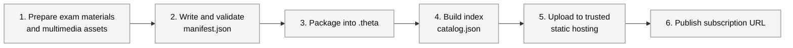

# Theta Format (`.theta`)

A universal, open data format and transmission specification for exam question banks.

[简体中文](../README.md)

---

- **GitHub Repository**: [https://github.com/thetaformat/protocol.git](https://github.com/thetaformat/protocol.git)
- **Specification Version**: `1.0.0`

---

## 1. Introduction and Design Philosophy

`.theta` is a structured, natively open data format and transmission specification for exam question banks designed for the AI era. Traditional educational measurement data standards (such as QTI and Common Cartridge) can be bulky, less friendly to modern AI computing, and difficult to implement for lightweight client-side interactions.

The core design philosophy of Theta Format includes:

1. **AI-Native**: Data is highly structured with descriptive Zod schemas, making it easier for large language models to perform content generation, proofreading, structured extraction, and multi-dimensional data analysis.
2. **Open Standards and Data Sovereignty (Open & Vendor-Neutral)**: The protocol is fully open-source. We aim to break down the data silos of commercial LMS (Learning Management System) platforms by completely decoupling the parsing engine from data storage. Educators, institutions, and schools maintain absolute control over their data without being locked into specific servers or commercial databases.
3. **Strong Type Guarantees (SSOT)**: We enforce a "Single Source of Truth" (SSOT) using Zod and TypeScript strong type systems to prevent alignment issues between exam content and engineering code during rapid iterations.

---

## 2. Physical Structure of `.theta` Files

A `.theta` file is essentially a standard ZIP archive (with the extension changed to `.theta`). Its internal physical layout is structured as follows:

```text
my-exam-paper.theta
├── manifest.json         # Contains exam outline, item tree, rich-text stems, and response/scoring schemas
└── media/                # Folder storing static media assets associated with the exam
    ├── 3a1f4b8c-d2e9-4f0a-b1c2-d3e4f5a6b7c8.mp3  # Audio file named using a UUID
    └── c4d3e2b1-a0f9-4e8d-8c7b-6a5b4c3d2e1f.png  # Image file named using a UUID
```

- **`manifest.json`**: Complies with the constraints of `ManifestSchema`. It defines the nested relationships between the paper, sections, tasks, and items.
- **Standardized Static Assets**: Multimedia assets in the `media/` directory use UUIDs for unified resource addressing, facilitating deduplication in cloud storage environments.

---

## 3. Subscription Source Contribution Guide

**This project is not only for LMS system developers but is also an open tool for content creators.**

In the era of digital education, outstanding educators, teachers, and third-party creators are at the core of the ecosystem. By introducing a standardized subscription source mechanism, we aim to help creators distribute high-quality content more easily and build direct connections. We encourage the community to build an open, thriving, and respectful question bank ecosystem.

### 3.1 What is a Question Bank Subscription Source?

A subscription source consists of a public or protected URL pointing to a structured index file `catalog.json` that complies with `CatalogSchema`. This index file declares provider information, the last updated timestamp, and the download URLs (`downloadUrl`) of individual exam packages (`.theta`).

### 3.2 Workflow for Creation and Contribution



#### Step 1: Prepare Exam Materials and Multimedia Assets

Before packaging into the format, gather your self-developed or authorized exam content. The recommended workflow is:

1. **Content Organization**: Organize the metadata of the exam (e.g., collection name, paper name, publish date) along with detailed outlines, stems, options, and reference answers.
2. **Extract Multimedia Assets**: Extract all static files referenced in the exam (such as images `.png/.jpg`, audio `.mp3`, videos `.mp4`, etc.) into a dedicated local folder.
3. **Confirm Schema Compatibility**: Check the protocol documentation (see Section 4) to ensure your exam type is supported by an existing schema in the Theta Format.

#### Step 2: Write and Validate `manifest.json`

Ensure your exam data strictly complies with the structure of `ManifestSchema`. You can use the Zod validator exported by this protocol to write a simple local validation script (e.g., `validate.js`):

```javascript
import fs from 'fs';
import { ManifestSchema } from '@thetaformat/protocol';

// Read local manifest.json
const rawData = JSON.parse(fs.readFileSync('./manifest.json', 'utf-8'));

// Run Zod strong type validation
const result = ManifestSchema.safeParse(rawData);

if (!result.success) {
	console.error('❌ Data validation failed. Error details:');
	console.error(JSON.stringify(result.error.format(), null, 2));
	process.exit(1);
} else {
	console.log(
		'✅ Success! manifest.json matches the Theta protocol specification.',
	);
}
```

#### Step 3: Rename Multimedia Files and Package

1. **Rename Multimedia**: Rename the multimedia assets (audio, images, videos) used in your exam to standard UUID formats, such as `3a1f4b8c-d2e9-4f0a-b1c2-d3e4f5a6b7c8.mp3`.
2. **Reset Paths**: Configure the corresponding `fileKey` in `manifest.json` and place these files into the `media/` directory.
3. **Compress**: Package `manifest.json` and the `media/` directory together into a standard ZIP archive, then change the file extension to `.theta`.

#### Step 4: Build the Subscription Source Index File `catalog.json`

Referring to `CatalogSchema`, write an index file to aggregate one or more exam papers:

```json
{
	"publisherName": "Teacher Xiao Bai",
	"createdAt": "2026-01-21T08:00:00Z",
	"updatedAt": "2026-01-21T08:00:00Z",
	"papers": [
		{
			"fileKey": "75f4005b-c343-4d2e-8188-998d60dc4ca6.theta",
			"createdAt": "2026-01-21T08:00:00Z",
			"updatedAt": "2026-01-21T08:00:00Z",
			"examCode": "toefl_ibt_20260121",
			"collectionName": {
				"zh": "自研摸底测试试卷集",
				"en": "Placement Exam Papers"
			},
			"paperName": {
				"zh": "摸底测试试卷-1",
				"en": "Placement Exam Paper 1"
			},
			"issueDate": "2026-07-26T08:00:00Z",
			"downloadUrl": "https://cdn.example-community.org/75f4005b-c343-4d2e-8188-998d60dc4ca6.theta",
			"fileSizeInBytes": 10485760
		}
	]
}
```

#### Step 5: Flexible Hosting & Distribution

Creators retain 100% ownership and control over their content. You can upload the created `.theta` files and the `catalog.json` index to any trusted hosting space, including but not limited to:

- Cost-effective object storage with global CDNs (e.g., Cloudflare R2, Tencent Cloud COS, AWS S3, etc.)
- Static page hosting services (e.g., GitHub Pages, Vercel, etc.)
- Private cloud drives or internal servers within an organization

Users only need to enter your `catalog.json` URL as a subscription source in SaaS or client applications compatible with the Theta format to quickly parse, preview, and import the exam contents. This flexible distribution model helps educators and independent creators build direct connections.

#### Step 6: Publish the Subscription URL

After successfully uploading `catalog.json` and its associated `.theta` files to a static hosting platform, you will obtain a public URL for the index file (e.g., `https://cdn.example-community.org/catalog.json`). This becomes your **dedicated question bank subscription source**.

1. **One-Click Connection**: Share this URL with your students, teaching teams, or the open-source community. Once entered into a compatible LMS or client, the system will automatically parse, load, and render your questions.
2. **Seamless Updates**: To publish new papers or correct existing items, simply re-upload the updated files and update the `updatedAt` and version information in `catalog.json`. Subscribed clients will fetch the latest content automatically.

---

## 4. Supported Exam Schemas

The latest protocol version supports the following exam schemas:

| Exam Code            | Target Exam | Official Release Date |
| :------------------- | :---------- | :-------------------- |
| `toefl_ibt_20260121` | TOEFL iBT   | 2026-01-21            |

> 💡 **Tip**: To extend or contribute new exam schemas, please refer to the `src/exams/` directory in the project repository and submit a Pull Request.

---

## 5. Intellectual Property & Copyright Compliance

We believe that the open education ecosystem can grow sustainably only under strict respect for intellectual property rights. This protocol and its tools adhere to strict copyright compliance and fair use principles:

1. **Encourage Original and Open Sharing**: We strongly recommend that users utilize this specification for **self-developed content**, authorized public domain resources, or Open Educational Resources (OER) distributed under Creative Commons (CC) licenses.
2. **Fair Use**: This project strictly discourages any third-party use that constitutes infringement. All distributed content must have full authorization, and distributing pirated or leaked exam materials using this toolchain is strictly prohibited.
3. **Liability**: Creators distributing content via subscription sources are solely responsible for the copyright legality of their published materials. Let's work together to maintain a clean, legal, and sustainable environment for content creation.

---

## 6. Contribution and Development

We welcome educators, system developers, and LMS developers to adopt and extend this specification.

If you wish to participate in refining this standard, feel free to clone the repository and submit a Pull Request:

```bash
git clone https://github.com/thetaformat/protocol.git
```

Recommended commands for local development:

```bash
# Install dependencies
pnpm install

# Run TypeScript typecheck (to ensure changes match schema constraints)
pnpm typecheck

# Build and bundle assets
pnpm build
```

---

## 7. Open Source License

This project is open-sourced under the **Apache-2.0** license. See the [LICENSE](LICENSE) file for more details.
